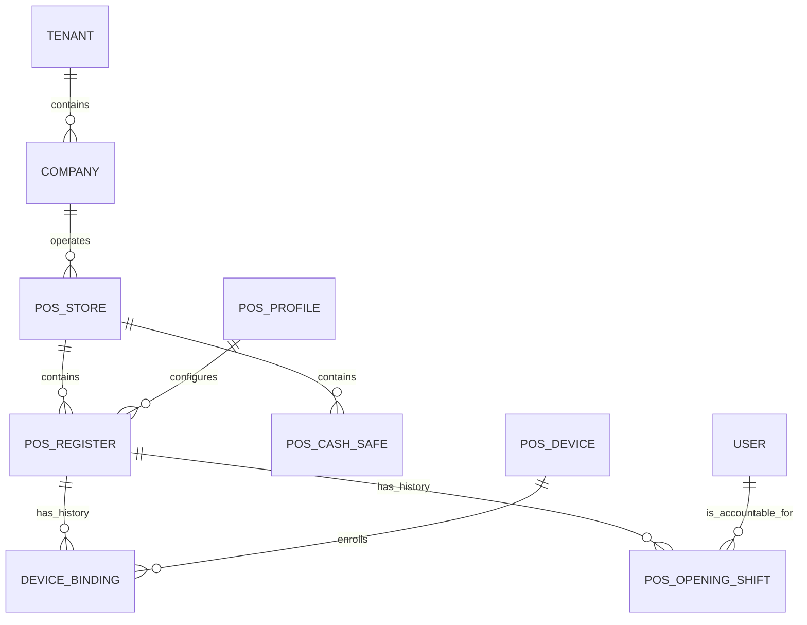

# 01 — Store and register foundation

Status: specified; not implemented or capacity-certified. Version 1, 2026-09-22.
Owner: POSAwesome. Dependencies: existing shift, scope, submission and custody services.
Normative terms: MUST is an acceptance requirement; SHOULD requires a documented exception.
All nine specifications form one contract; see the [index](README.md).

## 1. Outcome and boundary

A tenant operates multiple legal companies; each company has stores; each store
has named registers. Employees recognize “Centro / Caja Mostrador”, regardless
of which tablet is attached or who currently holds the drawer. A store is an
operational location, not a Company, Warehouse, POS Profile, browser or user.

The first usable slice is one company, one store, two cash registers, one safe,
two simultaneous cashiers and a manager without a selling shift. The model MUST
also admit the enterprise envelope in [09](09-scale-isolation-rollout.md).
Shared physical drawers across simultaneous cashiers, roaming cash drawers,
cross-company money transfers and active-active writes across database regions
are outside version 1. They must not be approximated by sharing credentials.

## 2. Verified starting point

- [shifts.py](../../../posawesome/posawesome/api/shifts.py) enforces one open
  shift per user and binds it to a POS Profile and browser credentials.
- [shift_terminal.py](../../../posawesome/posawesome/api/shift_terminal.py)
  protects selling ownership with a generation and possession secret; supervisor
  replacement preserves unresolved work.
- [custody service](../../../posawesome/posawesome/api/cash_custody/service.py)
  additionally permits only one open shift per custody-enabled profile.
- [POS Cash Safe](../../../posawesome/posawesome/doctype/pos_cash_safe/pos_cash_safe.json)
  has a unique profile and safe account. Existing custody is a safe/register pair.
- Profile membership is the current scope boundary in
  [_scope.py](../../../posawesome/posawesome/api/_scope.py). It cannot simply be
  replaced with a client-selected store ID.

These protections remain in force throughout migration. New terminology alone
does not enable multi-register custody.

## 3. Domain and records

Tenant is the authenticated Frappe site, resolved at the trusted request
boundary. It is not a writable business-record field that chooses a database.
Cross-site IDs always require site-qualified references outside the tenant.

| Record | Required contract |
| --- | --- |
| `POS Store` (new) | Opaque ID; unique company/store code; display name; Company; IANA timezone; local business-day cutoff; address reference; active state; policy version; permitted warehouses and profiles. Company is immutable after activity. |
| `POS Register` (new) | Opaque ID; unique store/register code; label; Store; POS Profile; mode `cash` or `cashless`; lifecycle; default safe; drawer account when cash; hardware profile revision; configuration revision. Store/company immutable after activity. |
| `POS Register Runtime` (new) | Exactly one row per register, unique register link; active opening shift or null; active binding or null; ownership generation; row revision. Mutable pointer, never financial history. |
| `POS Cashier Runtime` (new) | Exactly one row per User; accountable open shift or null; revision. Preserves the current one-open-shift-per-user rule atomically. |
| `POS Device` (new) | Site-local ID; friendly label; enrollment/revocation state; public fingerprint or protected possession-secret verifier; last acknowledged version/heartbeat; installation epoch. No raw secrets in records returned to clients. |
| `POS Device Binding` (new) | Device, register, generation, start/end, authorizer, reason; immutable historical assignments. One active selling binding per register and device. Order-only devices have a store assignment, not a fictitious cash drawer. |
| `POS Store Assignment` (new) | User or managed group, scope, role/capability set, validity interval, grantor and revision. No per-user child table containing every register. |
| `POS Opening Shift` (extend) | Store, register, business day, responsible User, binding generation, immutable configuration/account-routing snapshot and contract version; existing profile/company references retained. |

POSAwesome owns the operational Store. Doco's existing `Storefront Sucursal`
is a channel record with storefront/warehouse/catalog fields; it is not silently
promoted to the cash authority. An optional, validated link maps that channel
record to a POS Store without making Doco installation a POS requirement.
Warehouses may serve several stores; warehouse equality does not grant access.

POS Profiles remain reusable configuration records. A register resolves its
configuration from the profile plus a small typed register override allowlist.
Company, warehouse eligibility, payment routing, drawer, safe and hardware
bindings are explicit. Device display preferences remain device preferences.
Unknown override keys fail validation; there is no arbitrary JSON policy merge.

### Record and command validation

Store/register codes are normalized, case-insensitive within their declared
unique scope, 1–32 characters; display labels are 1–120 Unicode characters.
Opaque identity never changes when a label changes. Notes/reasons are bounded
to 2,000 characters; mandatory financial recovery reasons need meaningful text
and cannot be replaced with whitespace. Revision/generation are positive
monotonic integers, serialized without JavaScript precision loss. All timestamps
are server UTC instants with separate display timezone/business-date fields.

Referenced company, warehouse, profile, account and user must exist, be enabled
where the action requires it, and match the resolved scope. Cashless registers
have no drawer account/default-safe requirement and cannot accept cash through
an alternative endpoint. Creation has no expected prior revision; all subsequent
mutable commands require one or an explicitly documented idempotent source key.
Currency/precision are validated by the canonical monetary owner, never locale.

## 4. Invariants and lifecycle

**FND-01:** A financial action has one tenant, company, store, register, shift,
responsible cashier, acting identity and source device. Server derives these
from trusted records and checks every client reference for agreement.

**FND-02:** At most one accountable open shift exists per register and per
cashier. Opening locks the cashier and register runtime rows, checks both and
creates the shift plus pointers in the same transaction. Two racing opens
cannot both succeed. This rule also covers Desk, imports, jobs and REST.

**FND-03:** One active selling browser owns a shift. Heartbeat expiry changes
availability only; it never grants possession. Supervisor transfer increments
the generation and fences old submissions. Old queued work keeps its original
identity and enters recovery; it is never relabeled to a new cashier.

**FND-04:** Every cash drawer has an exclusive active accounting route in this
release. Distinct drawers cannot share a default cash account. Shared safe,
bank and transit accounts follow spec 03. Sale payments, refunds, expenses,
collections, movements and closing MUST use the same stamped drawer route;
changing only the cash-movement endpoint is insufficient.

**FND-05:** A configuration edit cannot change an open shift's accounts,
company, currency or mode. Edits produce a pending version effective at the
next opening. Revocation can remove authority immediately, with recovery of
already recorded intents handled explicitly.

Register lifecycle is `Draft → Ready → Suspended → Ready`, with `Retired` a
terminal state. Ready requires valid configuration and successful enrollment
requirements. Runtime status (`Available`, `Open`, `Handover`, `Closing`,
`Recovery`) and connectivity (`Fresh`, `Stale`, `Unknown`) are separate axes.
Retirement requires no open shift, unsettled transfer, unresolved ownership
recovery or unexplained drawer residual. History remains readable. Register
codes are not reused after financial activity; labels can change with audit.

Store suspension refuses new openings but preserves settlement/recovery paths
for existing obligations. An emergency stop is a separate, audited policy and
must state which sale/collection actions are blocked. Neither operation deletes
local work or pretends to revoke an already-offline browser instantaneously.

## 5. Employee and manager journeys

1. Manager opens Stores, creates the store with company/timezone, chooses an
   existing profile, validates warehouses and previews inherited settings.
2. “Add caja” asks for label, cash/cashless, drawer route, safe and equipment.
   Existing routes are suggested; conflicting drawer accounts are refused.
3. “Connect device” issues a short-lived, single-use enrollment challenge.
   The cashier sees the store/register name and confirms on that device.
4. Readiness identifies each unmet requirement with a link to its owning setup
   screen. Saved drafts remain resumable. Activation produces an audit record.
5. Cashier signs in, sees their assigned caja, confirms it, opens a shift and
   receives float through custody. Store/company/profile are not repeatedly
   requested when assignment determines them.
6. Manager returns to the filtered Cajas list, seeing the newly active register.
   A replacement device uses recovery, not “create another caja”.

Desk lists/forms and `/posapp` use identical business commands. Ordinary
employees cannot edit runtime pointers or financial scope through generic forms.
The store selector preserves unfinished work and requires explicit completion
or parking before changing the selling context.

## 6. Shared command, query and event protocol

This protocol is normative for specs 02–08. Endpoint names below are proposed
logical contracts, not claims that these APIs already exist.

Every command accepts `request_id`, `schema_version`, `expected_revision`,
the target ID, typed action data and possession proof where money/ownership is
affected. The server derives actor and tenant. Approval evidence references a
server-issued authorization tied to action, target, amount, revision and expiry.

Deduplication uniqueness is `(tenant database, command namespace, request_id)`.
The durable receipt stores canonical payload hash, original actor/scope,
status, result references and correlation ID. Reuse with a different payload or
actor is refused. Authorization is checked on replay before revealing a result.
Secrets are excluded from hashes/logs; identity and binding generation are not.
Existing invoice submission and custody receipts must be adapted/reused, not
shadowed with a second path that can submit money twice.

Database-local actions commit business records, audit, receipt and outbox event
atomically. No success precedes commit. Long jobs return `accepted` with an
operation ID; only `completed` proves the business action finished. External
providers use their own durable attempt/idempotency contract; a lost response
produces `outcome_unknown`, never an automatic new payment attempt.

Common errors are `scope_denied`, `revision_conflict`, `invalid_state`,
`ownership_changed`, `outcome_unknown`, `dependency_unavailable`,
`rate_limited` and `validation_failed`. Include safe explanation, retryability,
correlation ID and allowed next actions. No existence leak across scopes.

Queries use server-side scope, opaque signed cursors bound to filter/scope
revision, stable `(sort_key, id)` ordering and page size 50, maximum 100.
Unbounded “all registers/all shifts” endpoints are prohibited. DTOs omit
unauthorized fields rather than trusting CSS to hide them.

Events carry `event_id`, aggregate type/ID/revision, schema version, timestamp,
store and safe references where appropriate, source receipt and minimal changed
fields. Delivery is at least once through a transactional outbox. Consumers
deduplicate, detect missing revisions and can rebuild. No site-wide hot sequence
is required for ordinary register writes. Events notify; authoritative commands
recheck the database.

### Foundation operations

| Command/query | Preconditions | Durable result |
| --- | --- | --- |
| `stores.create/update` | Configuration authority; valid company; revision on edit | Store plus policy revision |
| `registers.create/configure` | Store scope; typed overrides; no prohibited active change | Draft/next configuration and validation report |
| `devices.enroll` | Single-use unexpired challenge; authorized store/register | Device/binding and possession credential delivered once |
| `registers.open` | Ready; current grants; runtime rows free; business day valid | Shift, snapshot, runtime pointers, ownership generation |
| `registers.suspend/retire` | Manager role and lifecycle preconditions | Audited lifecycle change, unresolved work links |
| `devices.replace/revoke` | Supervisor reauthentication; reason; recovery acknowledgment | Generation advance, revoked binding, recovery case |
| `registers.list/detail` | Read capability and explicit scope | Bounded DTO, freshness and allowed actions |

## 7. Authorization and locking

Capabilities distinguish selling, drawer custody, safe custody, store management,
regional review, configuration administration and financial audit. Scope is the
intersection of site, company, store assignment, profile eligibility, action and
current resource state. Regional access is hierarchical server-side scope, not
a browser list of all permitted IDs. A supervisor has no automatic site-wide
override. Frappe System Manager remains a privileged tenant administrator;
administrative bypass is audited and is not assigned to normal store managers.

| Capability group | Default scope/actions | Explicit exclusions |
| --- | --- | --- |
| Cashier | Assigned store/register, own shift/sales/counts, eligible float receipt | Other drawers, safe totals, independent self-review |
| Order taker | Assigned store's permitted order sources | Cash, paid invoices, drawer opening, selling ownership |
| Safe custodian | Assigned safe preparation/physical receipt/dispatch under policy | Self-verification, company-wide access by implication |
| Store supervisor | Store operations, assignments and authorized recovery | Other stores, unreviewed financial overrides |
| Financial reviewer | Assigned company/store counts, differences and close attestation | Invisible actor substitution or own discrepancy approval |
| Regional manager | Granted subtree rollups and explicitly delegated operations | Implicit tenant administrator status |
| Auditor | Scoped immutable evidence and permitted export | Mutations and ownership takeover |

These are capability bundles, not mandatory new Frappe roles. Reuse current
roles where semantics match and add explicit grants where needed. A group grant
is evaluated against its current membership; revoked membership cannot persist
through a stale expanded list. Initial staffed-store custody requires an
independent receiver/reviewer; do not force a single-operator legacy shop into
that workflow without a separately specified supported policy.

All multi-resource commands obey one lock order: operation receipt; cashier
runtime rows sorted by ID; register runtime rows sorted by ID; opening shifts
sorted by ID; business document aggregate if needed; safe rows sorted by ID;
bags/transfers/counts sorted by ID; accounting resources via the owning posting
service. Skip unused classes; never acquire an earlier class after a later one.
Business-day revision checks occur with the register admission barrier described
in spec 05, not through a store lock on every sale. Review ERPNext posting locks
under load; application ordering alone cannot prove absence of DB deadlocks.

Retries after database deadlock rerun the whole rolled-back transaction with
the same request ID, bounded backoff and a clear busy response. They must not
repeat an external side effect. Registration and grants use unique constraints
plus locked singleton rows, not an application-only “check then insert”.

## 8. Migration and compatibility

1. Inventory profiles, companies, active shifts, drawer accounts, safes, queued
   client versions and storefront mappings. Produce a dry-run report.
2. Add nullable links, new records, unique/index constraints after duplicate
   preflight, and compatibility readers. Do not rewrite submitted GL entries.
3. Create one legacy register per unambiguous existing profile. Group into
   stores only from an approved mapping; never infer a store from a name or
   shared warehouse. Ambiguous rows remain in legacy operation pending mapping.
4. Populate historical links through an auditable mapping or sanctioned patch;
   retain original profile/user/terminal fields and source document IDs.
5. Shadow-resolve configuration/account routes and compare against current
   results. Any difference blocks that register's activation.
6. Cut over at a drained shift boundary. Stamp a separate
   `register_contract_version=1` plus the current effective capability version.
   The capability payload already has version 3 at this baseline; do not reset
   or reuse it as a new register protocol version. Legacy
   clients continue only on unmigrated registers; reject them with a safe update
   path on migrated registers. Never reinterpret old queued cash work as the
   new register protocol. Legacy and new openings share the same user-level
   exclusion adapter until all clients migrate; separate runtime guards must
   not permit one legacy and one new shift for the same cashier.
7. Remove profile-level single-shift custody enforcement only for fully migrated
   registers after register-level exclusivity and shared-safe scope pass tests.

Before new financial activity, rollback can disable the feature and restore
legacy routing. After new-protocol transactions, rollback means a compatible application
release or forward fix; schema deletion or restoring an old DB is not a routine
rollback. Historical source links and receipt lookup stay supported.

## 9. Acceptance and implementation sequence

| ID | Required evidence |
| --- | --- |
| FND-T01 | Two cashiers open different registers sharing one profile and sell concurrently; invoices and GL route to the correct drawers. |
| FND-T02 | Two processes opening one register produce one shift; one cashier opening two registers also produces one. |
| FND-T03 | Tampered company/store/profile/shift IDs fail through SPA, Desk, REST and queued jobs without leaking records. |
| FND-T04 | Replacing a browser fences the original generation; delayed requests preserve source ownership and cannot create a second sale. |
| FND-T05 | Replayed enrollment/opening after a lost response returns the original result without duplicate bindings/shifts. |
| FND-T06 | Retiring a register with a bag, open shift, pending payment or recovery case explains each blocker. |
| FND-T07 | Profile changes affect the next shift; existing sale/refund/collection/expense routes remain unchanged. |
| FND-T08 | Cashless/order-only devices cannot manufacture a cash drawer balance. |
| FND-T09 | Migration handles one profile, reused profiles, shared warehouses, ambiguous mappings and active legacy clients without altering GL totals. |
| FND-T10 | Regional managers see only granted stores; grant removal invalidates queries, subscriptions, exports and command access. |
| FND-T11 | Fresh install, upgrade and compatibility rollback pass with complete guarded migration logs and zero unexplained deleted DocTypes. |
| FND-T12 | List/open/ownership operations meet the bounded-query and load gates in spec 09. |

Implement records and scope first; then configuration resolver and all accounting
consumers; then enrollment/open/replace; then migration adapter; then worker UI.
Release only after native concurrent-transaction and real browser journeys, not
mock-only tests. The revenue path must not depend on Boat availability.
